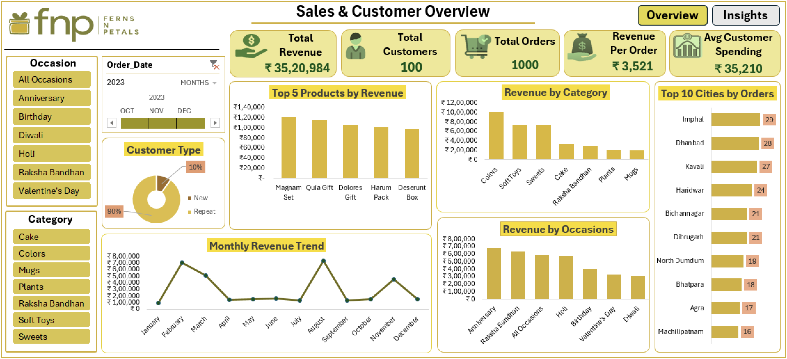
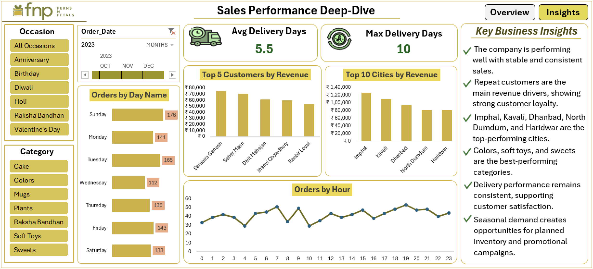

# 📊 Interactive Sales Dashboard (Excel)

An interactive Excel dashboard built to analyze sales performance and customer behavior using structured datasets. This project demonstrates strong skills in data analysis, visualization, and business intelligence.

---

## 📌 Project Overview

This dashboard combines multiple datasets (Customers, Orders, Products) to deliver clear and actionable insights. It helps understand revenue trends, customer patterns, and product performance through interactive visuals and filters.

---

## 🎯 Objectives

- Analyze overall sales and revenue performance  
- Identify top-performing products, categories, and cities  
- Understand customer behavior and repeat purchases  
- Track sales trends across months, days, and hours  
- Evaluate delivery performance and order efficiency  

---

## 📊 Dashboard Sheets

### 🔹 Sales & Customer Overview
- Key KPIs: Revenue, Orders, Customers  
- Monthly sales trends  
- Top products and categories  
- Customer segmentation (New vs Repeat)  

### 🔹 Sales Performance Deep Dive
- Orders analysis by day and hour  
- Top customers and top cities  
- Delivery performance metrics  
- Detailed business insights  

---

## 💡 Key Insights

- Repeat customers contribute the majority of revenue  
- Certain cities consistently generate higher sales  
- Sales show clear seasonal trends  
- Delivery performance remains stable  

---

## 🗂️ Dataset

The project uses the following datasets:
- Customers Data  
- Orders Data  
- Products Data  

---

## 🛠️ Tools Used

- Microsoft Excel  
- Pivot Tables  
- Data Visualization  

---

## 📸 Dashboard Preview

  

---

## 📂 Project Files

- Excel Dashboard File  
- Dataset Files (Customers, Orders, Products)  
- Dashboard Screenshots  

---

## 📌 Note

This project is created for learning and portfolio purposes using sample data.

---

## 👤 Author

Prem Ranjan  

---

## 🔗 Let's Connect

- 💼 LinkedIn: https://www.linkedin.com/in/prem-ranjan-6492623b1/
- 💻 GitHub:  https://github.com/prem-ranjan-analytics

⭐ If you like this project, consider giving it a star!
